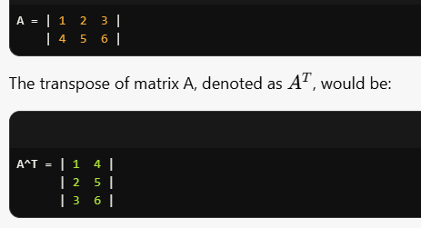
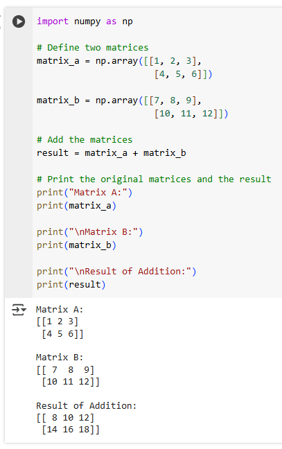
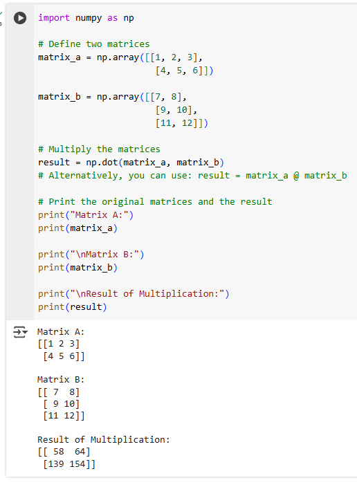
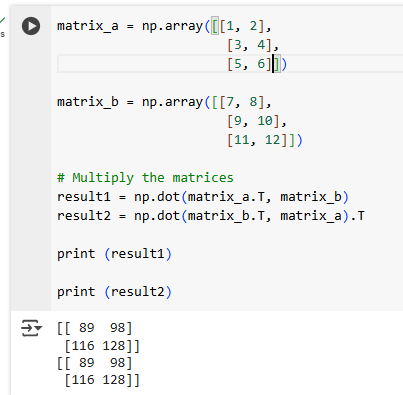

Importing the libraries

Importing the dataset

numpy: Thư viện này cung cấp các hỗ trợ để xử lý mảng đa chiều và thực hiện các phép toán toán học.

matplotlib.pyplot: Thư viện này được sử dụng để vẽ đồ thị. pyplot là một phần của Matplotlib giúp tạo ra các biểu đồ một cách dễ dàng.

pandas: Thư viện này giúp xử lý và phân tích dữ liệu, cung cấp các cấu trúc dữ liệu như DataFrame và Series.

Splitting the dataset into the Training set and Test set

Đoạn mã bạn cung cấp liên quan đến việc chia tập dữ liệu thành các tập huấn luyện và kiểm tra trong một bài toán học máy. Dưới đây là giải thích cho từng phần:

Training the Simple Linear Regression model on the Training set

 Predicting the Test set results

Đoạn mã bạn cung cấp liên quan đến việc tạo và huấn luyện một mô hình hồi quy tuyến tính trong Python sử dụng thư viện Scikit-learn. Dưới đây là giải thích chi tiết cho các phần của mã:

Đoạn mã bạn cung cấp sử dụng thư viện Matplotlib để vẽ đồ thị cho mô hình hồi quy tuyến tính dựa trên dữ liệu huấn luyện. Dưới đây là giải thích chi tiết cho từng phần:

Visualising the Training set results

Visualising the Test set results

