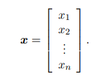
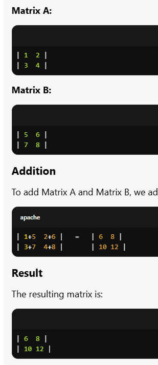
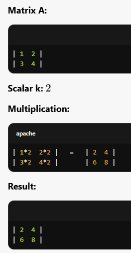
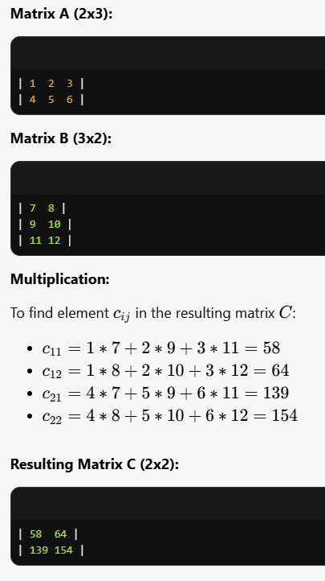
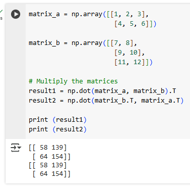
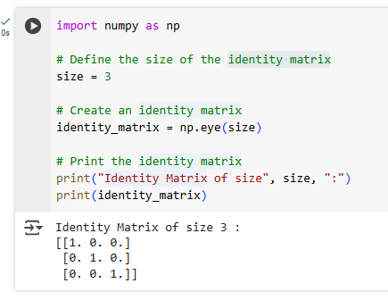
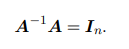

Scalars: số vô hướng

Vectors

Matrices

- transpose of matrix

code python transpose of matrix

- add matrices

code python

- multiply a matrix

code python

_____________________________

________________________________

_________________________________

identity matrix

Tensors: mảng đa chiều 